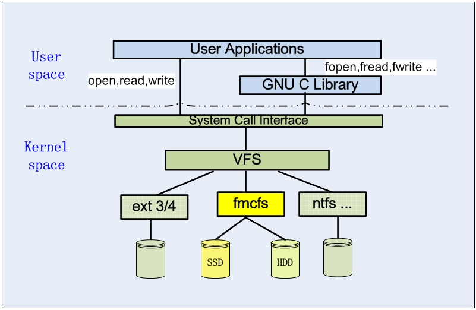

fmcfs: 一个整合 HDD 和 SSD 的分级文件系统
=====

##1. 简介

fmcfs 是在 Linux 环境下开发的一个用于整合磁盘和固态盘的分级文件系统. fmcfs 把存储设备分为两个级别, 其中固态盘(SSD)做为第一级别存储设备, 磁盘(HDD)做为第二级别存储设备. fmcfs 可以自动统计文件中每个数据块的历史访问信息, 识别出冷/热数据块, 然后在磁盘和固态盘之间自动地进行数据块的迁移和回迁操作. 

fmcfs 名称含义如下: 

>**f** 表示 Flash-based SSD, 

>**m** 表示 Magnetic-based HDD, 

>**c** 表示 Cloud storage, (注: 设计初期准备把云存储作为第三级存储整合进来, 但这项功能目前还没有开发, 留待以后扩展.)

>**fs** 表示 file system.

##2. fmcfs 文件系统架构
fmcfs 被设计为 Linux 下的一个文件系统功能模块, 在 Linux 中的位置如下图所示:

fmcfs 模块中有两个子功能模块: fmc\_ssd 模块和 fmc\_hdd 模块. 模块功能如下所示:

+ fmc\_ssd 模块以日志方式管理 SSD 卷空间, 并在需要时把冷数据块自动回迁到 HDD 卷.
+ fmc\_hdd 模块借鉴 ext 文件系统格式管理 HDD 卷空间, 并额外提供了统计文件数据块历史访问信息的功能, 以及把热点数据块自动迁移到 SSD 卷的功能.

##3. 源代码文件说明

